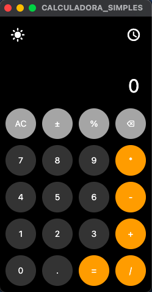

## Calculadora em Python com Flet (UI estilo iPhone)   

Projeto de uma calculadora desktop desenvolvida em Python com interface gráfica usando Flet, inspirada na calculadora do iPhone.  

Este projeto foi desenvolvido durante minhas férias da faculdade, como parte do meu processo de aprendizado prático com Python, saindo do básico de scripts para algo mais próximo de um produto real.




---

## 🎯 Objetivo do Projeto  : m   

O objetivo foi evoluir do uso de scripts simples para a construção de uma aplicação desktop com interface gráfica, eventos, organização de código e empacotamento do app.

Todo o desenvolvimento foi feito no processo de tentativa e erro, enfrentando bugs reais e aprendendo na prática como estruturar um projeto Python para algo apresentável em portfólio.


---

## 🛠 Tecnologias Utilizadas

- Python 3.12  
- Flet (UI desktop)  
- PyInstaller (empacotamento do app)  
- Git e GitHub  
- VS Code  

---

## ✨ Funcionalidades

- Interface gráfica inspirada na calculadora do iPhone  
- Tema claro e escuro  
- Histórico de operações  
- Suporte às quatro operações básicas  
- Porcentagem, troca de sinal (±) e backspace  

---

## 📚 Principais Aprendizados

- Estruturação de um projeto Python além de scripts simples  
- Gerenciamento de eventos e estado no Flet  
- Debugging na prática  
- Empacotamento de aplicações Python para desktop  
- Boas práticas básicas de versionamento com Git/GitHub  
- Documentação de projeto para portfólio  

---

## 📈 Contexto Pessoal

Estou em fase de aprendizado e transição para a área de tecnologia.  
Atualmente curso Administração na :contentReference[oaicite:0]{index=0} e estudo Análise de Dados na :contentReference[oaicite:1]{index=1}.  

Este projeto representa um passo importante da minha evolução prática com Python.

---

## 🔧 Próximas Melhorias (Ideias)

- Separar melhor a lógica da calculadora da camada de interface  
- Criar testes automatizados  
- Remover uso de `eval()` e criar um parser matemático próprio  
- Criar persistência do histórico  
- Versão multiplataforma (Windows/Linux)  

---

## 🚀 Como Executar o Projeto  : m

```bash
pip install -r requirements.txt
python CALCULADORA_SIMPLES.py


